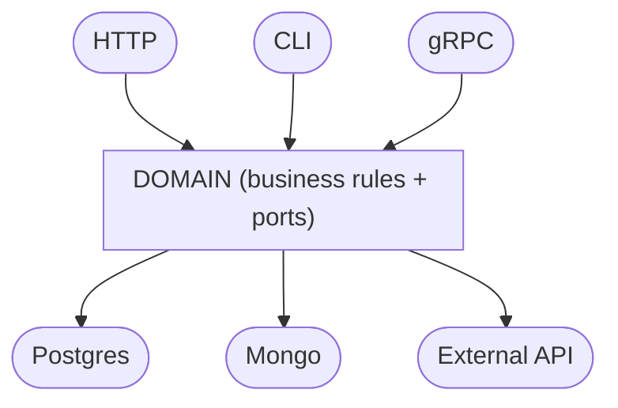

> If your business rule depends on `*sql.DB`, `http.Request`, or any technical detail, then your system is already coupled - you just have not felt the impact yet.

## What Is Hexagonal Architecture?

Hexagonal Architecture - also known as **Ports and Adapters** - is a pattern created by [**Alistair Cockburn**](https://alistaircockburn.com/) in 2005. The core idea is simple: **isolate business logic from all technical details** (database, HTTP, message queues, etc.).

The name "hexagonal" is not special by itself - the hexagon is just a visual representation that makes it clear there are multiple entry and exit points in the system, with no hierarchy between them.

If you have never heard of this, think about it like this:

> Imagine your system as a box. Inside the box lives the business logic. Outside the box are details: the database you chose, the HTTP framework, third-party APIs. Hexagonal architecture defines how these two worlds communicate without one invading the other.

---

## Why Does This Matter?

Most projects start organized and become difficult to maintain over time. The pattern is almost always the same:

* one HTTP route calls a service
* the service calls a repository
* the repository talks directly to the database

At first, it looks clean. After a few months, problems show up:

* need to switch the database -> touch several layers
* want to test a business rule -> forced to spin up a database
* change the framework -> rewrite half the system
* business rules start depending on `*sql.DB`, `http.Request`, `os.Getenv`...

The problem is not layering itself. The problem is the **dependency direction**: business logic is coupled with technical choices and implementation details.

---

## The Turning Point

Hexagonal architecture flips this:

> **Technical details depend on business logic - never the other way around.**

To do that, it uses two concepts:

**Port:** an interface defined by the domain that describes what it needs - without saying how.

**Adapter:** a concrete implementation of that interface, connecting the domain to real technology (database, HTTP, queue, etc.).

Visually:



The domain stays at the center. Everything around it implements the interfaces the domain defined.

---

## Why Does Go Fit So Well Here?

Go has an implicit interface system: **you do not need to declare that a struct implements an interface**. It only needs the required methods.

That removes coupling at definition time:

```go
// the domain defines the interface
type UserRepository interface {
    Save(user User) error
}

// infrastructure implements it - with no explicit reference back to the domain contract declaration
type PostgresRepo struct { db *sql.DB }

func (r *PostgresRepo) Save(user domain.User) error { ... }
```

`PostgresRepo` implements `UserRepository` automatically. The domain does not know - and does not need to know - that `PostgresRepo` exists.

On top of that, Go encourages composition through small interfaces, which matches the concept of well-defined ports directly.

---

## Full Example: Registering a User

Let us build it from scratch, layer by layer.

### 1. Domain - the heart of the system

```go
package domain

// User is the main entity - it only exists in the domain.
type User struct {
    Email string
}

// UserRepository is a port: it defines what the domain needs,
// without knowing who will implement it.
type UserRepository interface {
    Save(user User) error
}

// UserService contains business logic.
// It depends only on the interface - never on Postgres, Mongo,
// or any other technical detail.
type UserService struct {
    repo UserRepository
}

func NewUserService(repo UserRepository) *UserService {
    return &UserService{repo: repo}
}

func (s *UserService) Register(email string) error {
    // validation, business rules, domain events...
    user := User{Email: email}
    return s.repo.Save(user)
}
```

`UserService` does not import `database/sql`. It does not import any framework. It only knows `UserRepository` - an interface it defined itself.

---

### 2. Adapter - the bridge to the database

```go
package postgres

import (
    "database/sql"
    "yourapp/domain"
)

// PostgresUserRepository is an adapter: it implements domain.UserRepository
// using Postgres as the concrete technology.
type PostgresUserRepository struct {
    db *sql.DB
}

func NewPostgresUserRepository(db *sql.DB) *PostgresUserRepository {
    return &PostgresUserRepository{db: db}
}

func (r *PostgresUserRepository) Save(user domain.User) error {
    _, err := r.db.Exec("INSERT INTO users (email) VALUES ($1)", user.Email)
    return err
}
```

This file knows the domain - but the domain does not know this file. Dependency flows in one direction.

---

### 3. Wiring - connecting the pieces

```go
package main

import (
    "yourapp/domain"
    "yourapp/postgres"
)

func main() {
    db := setupDatabase() // infrastructure detail

    repo := postgres.NewPostgresUserRepository(db)
    service := domain.NewUserService(repo)

    if err := service.Register("user@example.com"); err != nil {
        panic(err)
    }
}
```

`main` is the only place that knows everything. It assembles the pieces. The domain never sees the database.

---

## What This Solves in Practice

### Tests without infrastructure

To test `UserService`, you only need a fake repository that satisfies the interface:

```go
type FakeUserRepository struct {
    saved []domain.User
}

func (f *FakeUserRepository) Save(user domain.User) error {
    f.saved = append(f.saved, user)
    return nil
}

func TestRegister(t *testing.T) {
    repo := &FakeUserRepository{}
    service := domain.NewUserService(repo)

    err := service.Register("test@example.com")
    if err != nil {
        t.Fatal(err)
    }
    if len(repo.saved) != 1 {
        t.Fatal("user was not saved")
    }
}
```

No database. No Docker. No environment setup. The test runs in milliseconds.

---

### Switch technology without touching the domain

Want to migrate from Postgres to MongoDB?

Create a new adapter that implements `UserRepository`. The domain does not change a single line.

---

### Add a new entry point

Want to expose the same `UserService` through HTTP and gRPC?

Create an HTTP adapter and a gRPC adapter, both calling the same domain service.

---

## Suggested Folder Structure in Go

```bash
yourapp/
|-- domain/
|   |-- user.go          # entity + interface (port)
|   `-- user_service.go  # business logic
|-- adapters/
|   |-- postgres/
|   |   `-- user_repo.go # database adapter
|   `-- http/
|       `-- user_handler.go # HTTP adapter
`-- main.go              # wiring
```

Simple. Each folder has a clear responsibility. `domain/` never imports anything from `adapters/`.

---

## When to Use It - and When Not To

**It makes sense when:**

* the system has real business rules that need protection
* you need to test logic without depending on database or external services
* there is a real chance of switching technologies in the future

**It does not make sense when:**

* it is a simple CRUD with little business logic
* the project is small and complexity is not justified
* you are still exploring the problem

Hexagonal architecture is not a silver bullet. It is a tool for a specific problem: **decoupling business logic from technical details**.

---

## Summary

| Concept | What it is |
| --- | --- |
| **Domain** | The business logic - what the system actually does |
| **Port** | An interface defined by the domain |
| **Adapter** | A concrete implementation of a port |
| **Wiring** | The point that connects everything (usually `main`) |

The key idea: **dependencies always point inward** - toward the domain, never away from it.

In Go, this feels natural. Implicit interfaces, composition, and no inheritance make this pattern straightforward to implement without unnecessary ceremony.

---

## References

[https://alistair.cockburn.us/hexagonal-architecture](https://alistair.cockburn.us/hexagonal-architecture)  
[Introducao a arquitetura hexagonal | Arquitetura Hexagonal em GoLang](https://www.youtube.com/watch?v=wYyHZL1r7dQ)  
[What is hexagonal architecture?](https://ttemporin.dev/o-que-e-arquitetura-hexagonal/)
