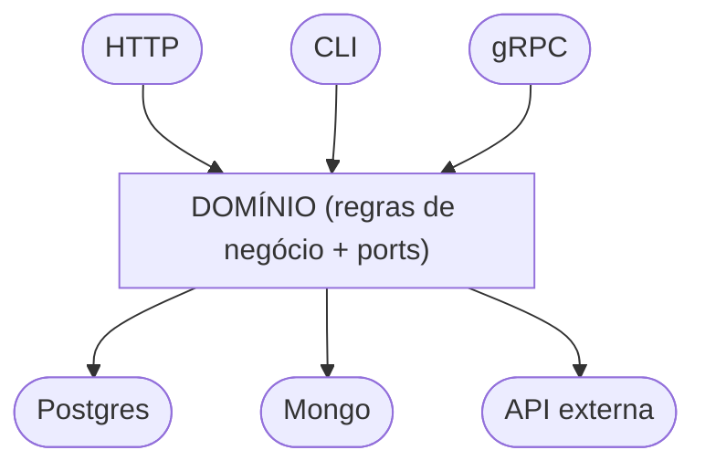

> Se sua regra de negócio depende de `*sql.DB`, `http.Request` ou qualquer detalhe técnico, então seu sistema já está acoplado — e você só ainda não sentiu o impacto.

## O que é Arquitetura Hexagonal?

Arquitetura Hexagonal — também chamada de **Ports and Adapters** — é um padrão criado por [**Alistair Cockburn**](https://alistaircockburn.com/) em 2005. A ideia central é simples: **isolar a lógica de negócio de tudo que é detalhe técnico** (banco de dados, HTTP, filas de mensagem, etc.).

O nome "hexagonal" não tem nada de especial — o hexágono é apenas uma representação visual que deixa claro que existem múltiplos pontos de entrada e saída no sistema, sem hierarquia entre eles.

Se você nunca ouviu falar disso, pode pensar assim:

> Imagine seu sistema como uma caixa. Dentro da caixa vive a regra de negócio. Fora da caixa ficam os detalhes: o banco que você escolheu, o framework HTTP, a API de terceiros. A arquitetura hexagonal define como esses dois mundos se comunicam sem que um invada o outro.

---

## Por que isso importa?

A maioria dos projetos começa organizada e vai ficando difícil de manter com o tempo. O padrão é quase sempre o mesmo:

* uma rota HTTP chama um serviço
* o serviço chama um repositório
* o repositório fala diretamente com o banco

No início parece limpo. Depois de alguns meses, surgem os problemas:

* precisa trocar o banco → mexe em várias camadas
* quer testar uma regra de negócio → é obrigado a subir banco
* muda o framework → reescreve metade do sistema
* regra de negócio começa a depender de `*sql.DB`, `http.Request`, `os.Getenv`...

O problema não é a separação em camadas. O problema é a **direção das dependências**: a lógica de negócio está acoplada com as escolhas técnicas e detalhes de implementação.

---

## A virada de chave

A arquitetura hexagonal inverte isso:

> **Os detalhes técnicos dependem da lógica de negócio — nunca o contrário.**

Para isso, ela usa dois conceitos:

**Port (porta):** uma interface definida pelo domínio que descreve o que ele precisa — sem dizer como.

**Adapter (adaptador):** uma implementação concreta dessa interface, ligando o domínio à tecnologia real (banco, HTTP, fila, etc.).

Visualmente:



O domínio fica no centro. Tudo ao redor implementa as interfaces que o domínio definiu.

---

## Por que Go se encaixa tão bem aqui?

Go tem um sistema de interfaces implícitas: **você não precisa declarar que uma struct implementa uma interface**. Basta ela ter os métodos certos.

Isso elimina o acoplamento na definição:

```go
// domínio define a interface
type UserRepository interface {
    Save(user User) error
}

// infraestrutura implementa — sem nenhuma referência explícita ao domínio
type PostgresRepo struct { db *sql.DB }

func (r *PostgresRepo) Save(user domain.User) error { ... }
```

`PostgresRepo` implementa `UserRepository` automaticamente. O domínio não sabe — nem precisa saber — que `PostgresRepo` existe.

Além disso, Go favorece composição via interfaces pequenas, o que combina diretamente com o conceito de ports bem definidos.

---

## Exemplo completo: registrar um usuário

Vamos construir do zero, camada por camada.

### 1. Domínio — o coração do sistema

```go
package domain

// User é a entidade principal — só existe no domínio.
type User struct {
    Email string
}

// UserRepository é um port: define o que o domínio precisa,
// sem saber quem vai implementar.
type UserRepository interface {
    Save(user User) error
}

// UserService contém a regra de negócio.
// Ele depende apenas da interface — nunca de Postgres, Mongo ou qualquer outro detalhe.
type UserService struct {
    repo UserRepository
}

func NewUserService(repo UserRepository) *UserService {
    return &UserService{repo: repo}
}

func (s *UserService) Register(email string) error {
    // aqui poderia entrar validação, regras, eventos de domínio...
    user := User{Email: email}
    return s.repo.Save(user)
}
```

O `UserService` não importa `database/sql`. Não importa nenhum framework. Ele só conhece `UserRepository` — que é uma interface que ele mesmo definiu.

---

### 2. Adapter — a ponte para o banco

```go
package postgres

import (
    "database/sql"
    "yourapp/domain"
)

// PostgresUserRepository é um adapter: implementa domain.UserRepository
// usando Postgres como tecnologia concreta.
type PostgresUserRepository struct {
    db *sql.DB
}

func NewPostgresUserRepository(db *sql.DB) *PostgresUserRepository {
    return &PostgresUserRepository{db: db}
}

func (r *PostgresUserRepository) Save(user domain.User) error {
    _, err := r.db.Exec("INSERT INTO users (email) VALUES ($1)", user.Email)
    return err
}
```

Este arquivo conhece o domínio — mas o domínio não conhece este arquivo. A dependência vai em uma única direção.

---

### 3. Wiring — conectando as peças

```go
package main

import (
    "yourapp/domain"
    "yourapp/postgres"
)

func main() {
    db := setupDatabase() // detalhe de infraestrutura

    repo := postgres.NewPostgresUserRepository(db)
    service := domain.NewUserService(repo)

    if err := service.Register("usuario@exemplo.com"); err != nil {
        panic(err)
    }
}
```

O `main` é o único lugar que conhece tudo. Ele monta as peças. O domínio nunca vê o banco.

---

## O que isso resolve na prática

### Testes sem infraestrutura

Para testar `UserService`, basta criar um repositório falso que satisfaça a interface:

```go
type FakeUserRepository struct {
    saved []domain.User
}

func (f *FakeUserRepository) Save(user domain.User) error {
    f.saved = append(f.saved, user)
    return nil
}

func TestRegister(t *testing.T) {
    repo := &FakeUserRepository{}
    service := domain.NewUserService(repo)

    err := service.Register("teste@exemplo.com")
    if err != nil {
        t.Fatal(err)
    }
    if len(repo.saved) != 1 {
        t.Fatal("usuário não foi salvo")
    }
}
```

Sem banco. Sem Docker. Sem configuração de ambiente. O teste roda em milissegundos.

---

### Trocar tecnologia sem tocar no domínio

Quer migrar de Postgres para MongoDB?

Cria um novo adapter que implementa `UserRepository`. O domínio não muda uma linha.

---

### Adicionar um novo ponto de entrada

Quer expor o mesmo `UserService` via HTTP e via gRPC?

Cria um adapter HTTP e um adapter gRPC, ambos chamando o mesmo serviço de domínio.

---

## Estrutura de pastas sugerida em Go

```bash
yourapp/
├── domain/
│   ├── user.go          # entidade + interface (port)
│   └── user_service.go  # lógica de negócio
├── adapters/
│   ├── postgres/
│   │   └── user_repo.go # adapter de banco
│   └── http/
│       └── user_handler.go # adapter HTTP
└── main.go              # wiring
```

Simples. Cada pasta tem uma responsabilidade clara. O `domain/` nunca importa nada de `adapters/`.

---

## Quando usar — e quando não usar

**Faz sentido quando:**

* o sistema tem regras de negócio reais que precisam de proteção
* você precisa testar lógica sem depender de banco ou serviços externos
* há chance real de trocar tecnologias no futuro

**Não faz sentido quando:**

* é um CRUD simples com pouca lógica
* o projeto é pequeno e a complexidade não justifica
* você ainda está explorando o problema

Arquitetura hexagonal não é bala de prata. É uma ferramenta para um problema específico: **desacoplar lógica de negócio de detalhes técnicos**.

---

## Resumo

| Conceito | O que é |
| --- | --- |
| **Domínio** | A lógica de negócio — o que o sistema realmente faz |
| **Port** | Uma interface definida pelo domínio |
| **Adapter** | Uma implementação concreta de um port |
| **Wiring** | O ponto que conecta tudo (geralmente o `main`) |

A ideia fundamental: **as dependências apontam sempre para dentro** — em direção ao domínio, nunca para fora dele.

Em Go, isso é natural. Interfaces implícitas, composição e ausência de herança tornam o padrão direto de implementar sem cerimônia desnecessária.

---

## Referências

[https://alistair.cockburn.us/hexagonal-architecture](https://alistair.cockburn.us/hexagonal-architecture)  
[Introdução à arquitetura hexagonal | Arquitetura Hexagonal em GoLang](https://www.youtube.com/watch?v=wYyHZL1r7dQ)  
[O que é arquitetura hexagonal?](https://ttemporin.dev/o-que-e-arquitetura-hexagonal/)  
